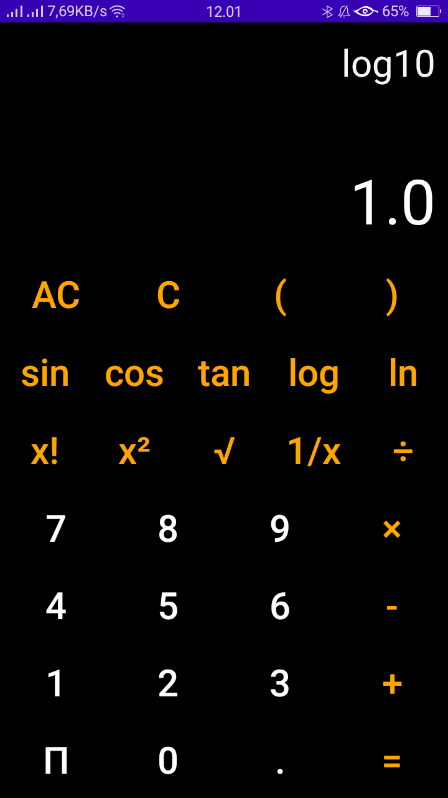

# Scientific Calculator
&nbsp;&nbsp;&nbsp;&nbsp;&nbsp;&nbsp;&nbsp;&nbsp;&nbsp;&nbsp;&nbsp;&nbsp;&nbsp; 
## Pengertian
> * Kalkulator ilmiah atau kalkulator scientific  adalah alat bantu hitung yang biasa digunakan untuk perhitungan berbasis sains misalnya bidang teknik.
> * Built with 
>   - [x] Android Studio 
>   - [x] Java
## Intro Slide
> Intro Slider menampilkan beberapa slide yang bisa di geser oleh user sebelum masuk ke menu utama pada sebuah aplikasi. Intro Slider hanya dapat berjalan 1 kali yaitu setelah penginstalan aplikasi <b> Berikut introslider yang digunakan pada aplikasi ini

## Halaman utama
> Setelah melalui intro slider akan menuju halaman utama. Halaman utama ini yang nantinya akan ditampilkan pada saat awal awal masuk aplikasi.

## Kalkulator
> <b> Walla!!! ini tujuan utama aplikasi ini yaitu kalkulator

# Terimakasi xixixi
> [Instagram](https://www.instagram.com/rensimyl/?hl=id)
